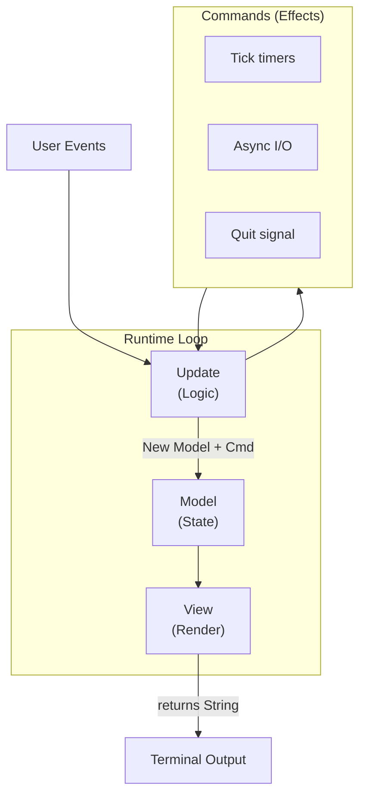

<div align="center">
    <p><a href="https://inferadb.com"></a></p>
    <h1>Ferment</h1>
    <p>A Rust Terminal UI framework inspired by Bubble Tea</p>
</div>

<br />

## Overview

`ferment` provides a functional, declarative approach to building terminal user interfaces:

- **Model-Update-View** - Core architecture based on The Elm Architecture
- **Composable Components** - Reusable widgets like spinners, inputs, and selectors
- **Form System** - Declarative form building with validation
- **CI-Friendly** - Automatic non-interactive mode detection

## Quick Start

```rust
use ferment::{Model, Program, Cmd, Event, KeyCode};

struct Counter {
    count: i32,
}

enum Msg {
    Increment,
    Decrement,
    Quit,
}

impl Model for Counter {
    type Message = Msg;

    fn init(&self) -> Option<Cmd<Self::Message>> {
        None
    }

    fn update(&mut self, msg: Self::Message) -> Option<Cmd<Self::Message>> {
        match msg {
            Msg::Increment => self.count += 1,
            Msg::Decrement => self.count -= 1,
            Msg::Quit => return Some(Cmd::quit()),
        }
        None
    }

    fn view(&self) -> String {
        format!("Count: {}\n\nPress +/- to change, q to quit", self.count)
    }

    fn handle_event(&self, event: Event) -> Option<Self::Message> {
        match event {
            Event::Key(key) => match key.code {
                KeyCode::Char('+') => Some(Msg::Increment),
                KeyCode::Char('-') => Some(Msg::Decrement),
                KeyCode::Char('q') => Some(Msg::Quit),
                _ => None,
            },
            _ => None,
        }
    }
}

fn main() -> Result<(), Box<dyn std::error::Error>> {
    Program::new(Counter { count: 0 }).run()?;
    Ok(())
}
```

## Components

### Text Input

Single-line text input with cursor support, placeholder text, and optional password masking.

```rust
use ferment::components::TextInput;

let input = TextInput::new()
    .placeholder("Enter your name...")
    .prompt("> ");
```

### Text Area

Multi-line text editor with cursor navigation, scrolling, and line editing.

```rust
use ferment::components::TextArea;

let textarea = TextArea::new()
    .placeholder("Enter your message...")
    .height(10)
    .width(60);
```

#### External Editor Support

Open content in your preferred editor with `Ctrl+O`:

```rust
let textarea = TextArea::new()
    .placeholder("Enter code...")
    .editor("code --wait")      // Use VS Code (default: $VISUAL or $EDITOR)
    .editor_extension("rs");    // File extension for syntax highlighting
```

### Selection Components

#### Select

Single-choice selection from a list of options.

```rust
use ferment::components::Select;

let select = Select::new("Choose a color")
    .options(vec!["Red", "Green", "Blue"]);
```

#### MultiSelect

Multiple-choice selection with checkboxes and optional min/max constraints.

```rust
use ferment::components::MultiSelect;

let select = MultiSelect::new("Choose colors")
    .options(vec!["Red", "Green", "Blue"])
    .min(1)
    .max(2);
```

#### Confirm

Yes/No confirmation prompt with customizable default.

```rust
use ferment::components::Confirm;

let confirm = Confirm::new("Are you sure?")
    .default(false);
```

#### List

Filterable, paginated list with keyboard navigation and search.

```rust
use ferment::components::List;

let list = List::new("Select a file")
    .items(vec!["main.rs", "lib.rs", "Cargo.toml"])
    .height(10)
    .filterable(true);
```

### Progress Indicators

#### Spinner

Animated loading indicator for indeterminate operations.

```rust
use ferment::components::{Spinner, SpinnerStyle};

let spinner = Spinner::new()
    .style(SpinnerStyle::Dots)
    .message("Loading...");
```

#### Progress

Progress bar for operations with known completion percentage.

```rust
use ferment::components::Progress;

let progress = Progress::new()
    .total(100)
    .current(45)
    .message("Downloading...");
```

#### MultiProgress

Parallel progress bars for tracking multiple concurrent tasks.

```rust
use ferment::components::MultiProgress;

let mp = MultiProgress::new()
    .add_task("download", "Downloading files...", 100)
    .add_task("compile", "Compiling...", 50)
    .add_task("test", "Running tests...", 200);
```

### Display Components

#### Viewport

Scrollable container for long content with keyboard navigation.

```rust
use ferment::components::Viewport;

let viewport = Viewport::new(80, 20)
    .content("Long scrollable content here...");
```

#### Table

Data table with columns, alignment options, and row selection.

```rust
use ferment::components::{Table, Column};

let table = Table::new()
    .columns(vec![
        Column::new("Name").width(20),
        Column::new("Age").width(5),
        Column::new("City").width(15),
    ])
    .rows(vec![
        vec!["Alice", "30", "New York"],
        vec!["Bob", "25", "Los Angeles"],
    ])
    .height(10);
```

## Forms

Build multi-step forms with validation, inspired by [Huh](https://github.com/charmbracelet/huh).

### Basic Form

```rust
use ferment::forms::{Form, Group, InputField, SelectField, ConfirmField};

let form = Form::new()
    .title("User Registration")
    .group(
        Group::new()
            .title("Personal Info")
            .field(InputField::new("name").title("Your name").required().build())
            .field(InputField::new("email").title("Email").build())
    )
    .group(
        Group::new()
            .title("Preferences")
            .field(SelectField::new("theme").title("Theme")
                .options(["Light", "Dark", "System"]).build())
            .field(ConfirmField::new("newsletter").title("Subscribe?").build())
    );
```

### Form Layouts

Control how form groups are displayed:

```rust
use ferment::forms::{Form, FormLayout};

// Default: one group at a time (wizard-style)
let wizard = Form::new().layout(FormLayout::Default);

// Stack: all groups visible at once
let stacked = Form::new().layout(FormLayout::Stack);

// Columns: side-by-side layout
let columns = Form::new().layout(FormLayout::Columns(2));
```

### All Field Types

```rust
use ferment::forms::{
    InputField, SelectField, MultiSelectField, ConfirmField,
    NoteField, FilePickerField
};

// Text input with validation
InputField::new("email")
    .title("Email Address")
    .placeholder("user@example.com")
    .required()
    .build();

// Single selection
SelectField::new("country")
    .title("Country")
    .options(["USA", "Canada", "UK", "Germany"])
    .build();

// Multiple selection with constraints
MultiSelectField::new("languages")
    .title("Languages")
    .options(["Rust", "Go", "Python", "TypeScript"])
    .min(1)
    .max(3)
    .build();

// Yes/No confirmation
ConfirmField::new("agree")
    .title("Accept terms?")
    .default(false)
    .build();

// Display-only note
NoteField::new("Please review carefully before proceeding.")
    .title("Important")
    .build();

// File/directory picker
FilePickerField::new("config_file")
    .title("Select config file")
    .directory("/etc")
    .extensions(["toml", "yaml", "json"])
    .build();
```

### Dynamic Content

Field titles and descriptions can update dynamically:

```rust
use std::sync::Arc;
use std::sync::atomic::{AtomicUsize, Ordering};

let attempt = Arc::new(AtomicUsize::new(1));
let attempt_clone = attempt.clone();

InputField::new("password")
    .title_fn(move || format!("Password (attempt {})", attempt_clone.load(Ordering::SeqCst)))
    .description_fn(|| "Must be at least 8 characters".to_string())
    .build();
```

### FilePicker Component

Browse and select files/directories:

```rust
use ferment::components::FilePicker;

let picker = FilePicker::new()
    .title("Select a file")
    .directory("/home/user/projects")
    .extensions(["rs", "toml"])  // Filter by extension
    .show_hidden(false)          // Hide dotfiles
    .height(15);                 // Visible rows

// Or for directory selection only
let dir_picker = FilePicker::new()
    .title("Select output directory")
    .dirs_only();
```

## Styling

Ferment includes a comprehensive styling system inspired by [Lip Gloss](https://github.com/charmbracelet/lipgloss).

### Basic Styling

```rust
use ferment::style::{Style, Color, Border};

let styled = Style::new()
    .fg(Color::Cyan)
    .bg(Color::Black)
    .bold()
    .italic()
    .border(Border::Rounded)
    .render("Hello, World!");
```

### CSS-like Shorthand

Padding and margin support CSS-style shorthand (1, 2, 3, or 4 values):

```rust
use ferment::style::Style;

// All sides: 2
Style::new().padding(&[2]);

// Vertical: 1, Horizontal: 2
Style::new().padding(&[1, 2]);

// Top: 1, Horizontal: 2, Bottom: 3
Style::new().margin(&[1, 2, 3]);

// Top: 1, Right: 2, Bottom: 3, Left: 4 (clockwise)
Style::new().margin(&[1, 2, 3, 4]);
```

### Block Dimensions

Control width, height, and alignment:

```rust
use ferment::style::{Style, Position};

let box_style = Style::new()
    .width(40)
    .height(10)
    .max_width(80)
    .align(Position::Center, Position::Center)
    .border(Border::Rounded);
```

### Layout Utilities

Compose blocks horizontally or vertically:

```rust
use ferment::style::{join_horizontal_with, join_vertical_with, place, Position};

// Side-by-side blocks (aligned at top)
let combined = join_horizontal_with(Position::Top, &[left_block, right_block]);

// Stacked blocks (centered horizontally)
let stacked = join_vertical_with(Position::Center, &[header, content, footer]);

// Position content in a box
let centered = place(80, 24, Position::Center, Position::Center, "Centered!");
```

### Adaptive Colors

Colors that adapt to light/dark terminal backgrounds:

```rust
use ferment::style::Color;

// Different colors for light vs dark backgrounds
let adaptive = Color::Adaptive {
    light: Box::new(Color::Ansi256(236)),  // Dark gray for light bg
    dark: Box::new(Color::Ansi256(252)),   // Light gray for dark bg
};

// Full color specification for all terminal types
let complete = Color::Complete {
    true_color: "#ff6600".to_string(),
    ansi256: 208,
    ansi: 3,  // Yellow fallback
};
```

### Style Inheritance

Build styles incrementally:

```rust
use ferment::style::Style;

let base = Style::new()
    .fg(Color::White)
    .bold();

let highlight = Style::new()
    .inherit(&base)       // Copy unset properties from base
    .bg(Color::Blue);

// Unset specific properties
let plain = highlight.unset_bold().unset_bg();
```

## Program Configuration

### Builder Pattern

Configure the program with a fluent builder API:

```rust
use ferment::{Program, Model};
use std::time::Duration;

Program::new(my_model)
    .with_alt_screen()           // Use alternate screen buffer
    .with_mouse()                // Enable mouse events
    .with_bracketed_paste()      // Enable paste detection
    .with_focus_change()         // Enable focus/blur events
    .with_tick_rate(Duration::from_millis(16))  // ~60 FPS
    .with_accessible()           // Force accessible mode
    .run()?;
```

### Message Filtering

Pre-process or block messages before they reach your update function:

```rust
Program::new(my_model)
    .with_filter(|model, msg| {
        // Block all messages while loading
        if model.is_loading {
            return None;
        }
        // Transform or pass through
        Some(msg)
    })
    .run()?;
```

### Commands

The `cmd` module provides Bubble Tea-style command functions:

```rust
use ferment::cmd;
use std::time::Duration;

// Quit the program
cmd::quit()

// Batch multiple commands
cmd::batch(vec![cmd1, cmd2, cmd3])

// Sequential execution
cmd::sequence(vec![cmd1, cmd2, cmd3])

// Periodic tick
cmd::tick(Duration::from_secs(1), |_| Msg::Tick)

// No-op command
cmd::none()
```

### External Process Execution

Spawn external processes (editors, etc.) with terminal teardown/restore:

```rust
use ferment::Cmd;
use std::process::Command;

let mut cmd = Command::new("vim");
cmd.arg("file.txt");

Cmd::run_process(cmd, |result| {
    match result {
        Ok(status) => Msg::EditorClosed(status.success()),
        Err(_) => Msg::EditorFailed,
    }
})
```

## Architecture

The framework follows The Elm Architecture:

1. **Model** - Your application state (any Rust struct)
2. **Message** - Events that trigger state changes
3. **Update** - Pure function that handles messages and updates state
4. **View** - Pure function that renders state as a string
5. **Commands** - Side effects (timers, async operations)



## CI/Script Compatibility

The framework automatically detects non-interactive environments:

- No animations or spinners
- Clear error messages
- Appropriate exit codes
- Works with piped input/output

## Accessibility

Ferment supports accessible mode for screen reader users and other assistive technologies.

### Enabling Accessible Mode

Set the `ACCESSIBLE` environment variable:

```bash
ACCESSIBLE=1 ./my-app
```

### What Changes in Accessible Mode

- **Plain text output** - No ANSI escape codes or visual formatting
- **Numbered options** - Selection components use numbers instead of arrow navigation
- **Line-based input** - Standard stdin reading instead of raw terminal mode
- **Clear prompts** - Screen reader-friendly text descriptions

### Accessible Forms

Use `Form::run_accessible()` for a fully accessible form experience:

```rust
use ferment::forms::{Form, Group, InputField, SelectField, ConfirmField};

let mut form = Form::new()
    .title("User Survey")
    .group(
        Group::new()
            .field(InputField::new("name").title("Your name").build())
            .field(SelectField::new("color").title("Favorite color")
                .options(["Red", "Green", "Blue"]).build())
            .field(ConfirmField::new("subscribe").title("Subscribe to newsletter?").build())
    );

// Run in accessible mode (line-based prompts)
match form.run_accessible() {
    Ok(Some(results)) => {
        println!("Name: {}", results.get_string("name").unwrap_or(""));
        println!("Color: {}", results.get_string("color").unwrap_or(""));
        println!("Subscribe: {}", results.get_bool("subscribe").unwrap_or(false));
    }
    Ok(None) => println!("Form cancelled"),
    Err(e) => eprintln!("Error: {}", e),
}
```

### Example Accessible Session

```
=== User Survey ===

Your name
?
> Alice

Favorite color
? Favorite color
  1) Red
  2) Green
* 3) Blue
Enter number (or q to cancel): 3

Subscribe to newsletter?
? Subscribe to newsletter? (y/N) y

Form completed!
```

### Custom Accessible Components

Components can implement the `Accessible` trait for custom accessible rendering:

```rust
use ferment::{Accessible, Model};

impl Accessible for MyComponent {
    type Message = MyMsg;

    fn accessible_prompt(&self) -> String {
        // Return plain text prompt
        format!("? {}\n> ", self.title)
    }

    fn parse_accessible_input(&self, input: &str) -> Option<Self::Message> {
        // Parse line input and return message
        Some(MyMsg::SetValue(input.trim().to_string()))
    }

    fn is_accessible_complete(&self) -> bool {
        self.submitted
    }
}
```

### Environment Variables

| Variable          | Description                              |
| ----------------- | ---------------------------------------- |
| `ACCESSIBLE=1`    | Enable accessible mode                   |
| `NO_COLOR=1`      | Disable colors (respected automatically) |
| `REDUCE_MOTION=1` | Disable animations                       |

## License

[Apache-2.0](LICENSE)
